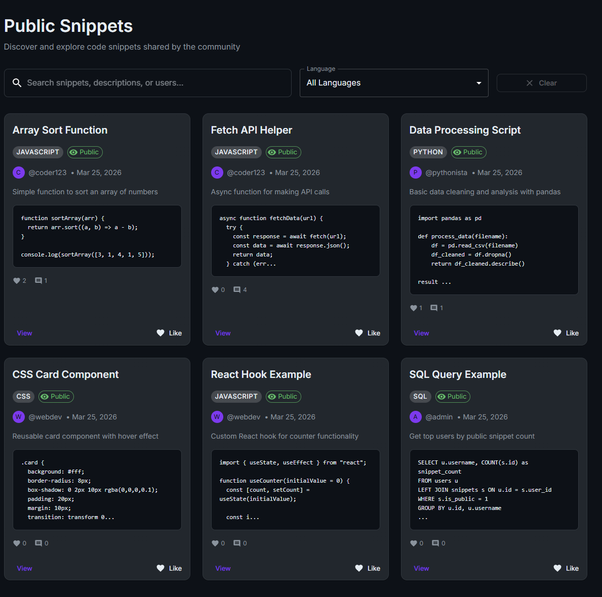

# CopyPasta

## Overview

Target: CopyPasta - a code snippet sharing app.

Goal: Obtain the flag from the application.

## Recon

The app exposes a Public Snippets page showing community snippets (JS/Python/CSS/SQL examples).

From UI behavior and intercepts, the app uses a JSON API (Express) and JWT-based auth.



## Key findings

1. Insecure direct object reference (IDOR) on profile endpoints
2. Broken password reset / password change authorization

## Step-by-step exploitation

### 1. Enumerate / access an admin profile via IDOR

Intercepting requests showed a profile endpoint that returned user data and associated snippets.

Request observed:

- `GET /api/profile/admin`

Response included the admin user object and their snippets (including one marked `private`).

Notable response fields:

- `username`: `admin`
- `email`: `admin@copypasta.com`
- `role`: `admin`

This indicated that user profiles were addressable directly by username and were not properly access-controlled.


### 2. Bruteforcing Admin login

The login endpoint was identified:

- `POST /api/login`

A password bruteforce (e.g., via Intruder/Hydra against the login request) was used to discover valid credentials for the `admin` account.

Result:

- Username: `admin`
- Password: `admin123`

A successful login returned a JWT token (used as `Authorization: Bearer <token>`).


### 3. Exploit broken authorization in password update

On the Account Settings page, changing a password triggered:

- `PUT /api/profile/password`

The request body included both a new password and a `user_id` parameter:

- `{"password":"testpass","user_id":x}`

Because the server accepted the `user_id` from the client, it allowed updating the password for an arbitrary user (horizontal/vertical privilege escalation), rather than only the currently authenticated user.

The server responded:

- `{"message":"Password updated successfully"}`


### (Side Note)

Additional testing revealed that obtaining the admin JWT was not required for to change a users password, this can also be done with a regular user.


### 4. Log in as the target user and retrieve the flag

After updating the password, logging in with the target account succeeded. I proceed with logging in as one of the snippet contributors on the Dashboard. (*coder123*)


## Obtaining The Flag

In the “My Snippets” dashboard, a private snippet titled similarly to:

- `bug{...}`

contained the CTF flag.


```json
bug{REDACTED}
```

## Root cause analysis

- Missing authorization checks on profile resources (IDOR).
- Password-change endpoint trusted client-provided identifiers (`user_id`) instead of binding the action to the authenticated user.

## Remediation

- Enforce authorization on all user-scoped endpoints (e.g., `/api/profile/:username`).
- For password changes, derive the target user strictly from the auth context (JWT/session), not from request parameters.
- Add server-side role checks for admin-only resources.
- Log and alert on password change events and suspicious cross-account operations.